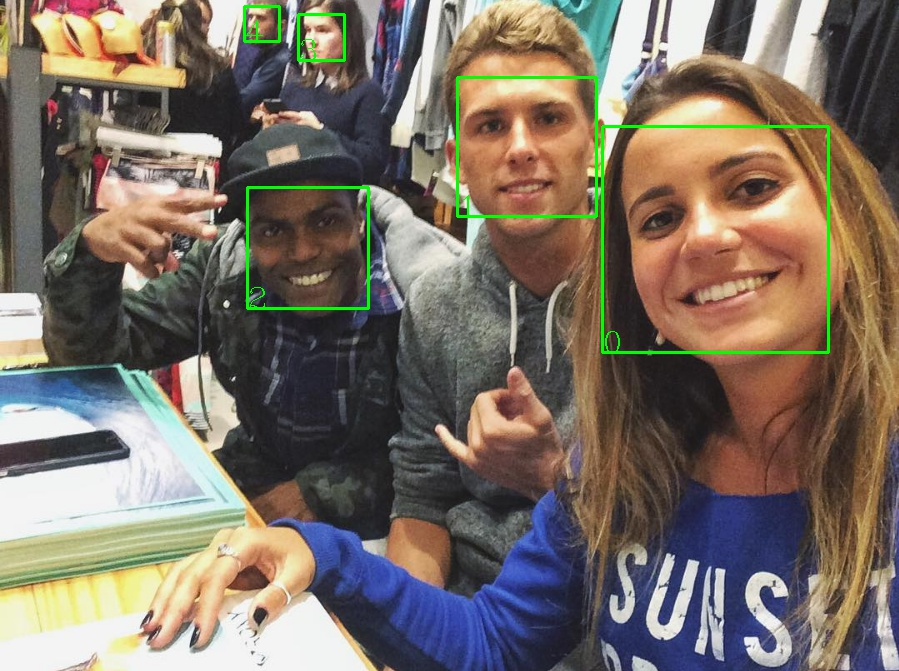
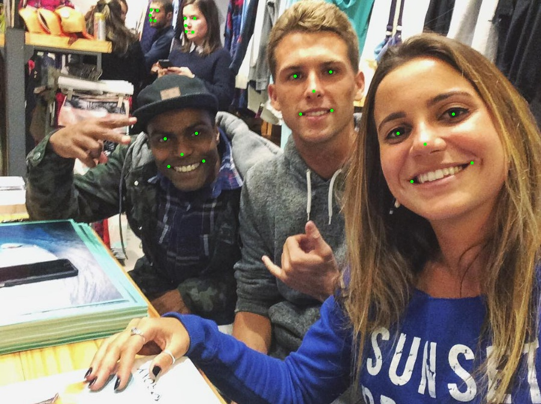
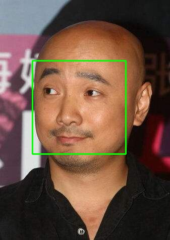
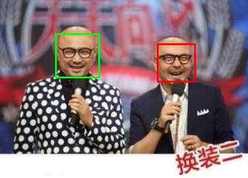

# pyseeta: python api for [SeetaFaceEngine](https://github.com/seetaface/SeetaFaceEngine.git)

[](https://travis-ci.org/TuXiaokang/pyseeta)
[](https://github.com/TuXiaokang/pyseeta/blob/master/LICENSE)

## for detection & alignment
<figure class='half'>
  
  
</figure>

## for identification
<figure class='half'>
  
  
</figure>

Installation
---
1. Download pyseeta(https://github.com/TuXiaokang/pyseeta.git)
2. `git submodule update --init --recursive`
3. Build `SeetaFaceEngine` dynamic library.

    on unix
    ```bash
    cd SeetaFaceEngine/
    mkdir Release; cd Release
    cmake ..
    make  
    ```
    on windows

    ```bash
    cd SeetaFaceEngine/
    mkdir Release; cd Release
    cmake -G "Visual Studio 14 2015 Win64" ..
    cmake --build . --config Release
    ```
4. the generated dynamic lib is in `SeetaFaceEngine/Release`

5. run test

    on ubuntu
	```bash
	sudo python setup.py install
	sudo apt-get install unrar
	cd SeetaFaceEngine/model/
	unrar e seeta_fr_v1.0.part1.rar
	cd ..
	cd ..
	python test.py
	```
    on windows
	```bash
	python setup.py install
	python test.py
	```

Update Log
---
* **v0.3.0**
  + support pillow image

Tips
---
If you want to use function of faceidentification, you need decompress the `seeta_fr_v1.0.part.1.rar` which located in `SeetaFaceEngine/model`
